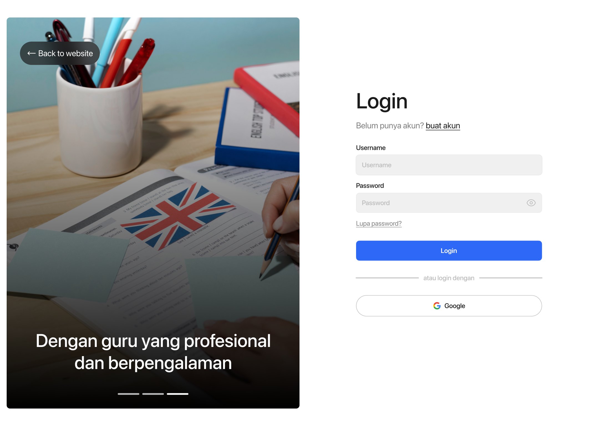

# PBLTOEST

A web application built with **Laravel** and **Blade** for the **TOEST Web App**, designed to assist with TOEIC Test registration at Politeknik Negeri Malang.

---

## 📂 Project Structure

```
app/  
bootstrap/  
config/  
database/  
public/  
resources/  
routes/  
storage/  
tests/  
.env.example  
artisan  
composer.json  
package.json  
vite.config.js  
…  
```

- `app/` — contains the main Laravel code (Models, Controllers, etc.)  
- `resources/views` — Blade template files  
- `public/` — static files (CSS, JS, images)  
- `routes/` — application route definitions  
- `database/migrations` & `database/seeders` — database migrations and seeders  
- `tests/` — unit/feature tests  
- `.env.example` — environment configuration example  
- `vite.config.js`, `package.json` — frontend/build configuration  

---

## 🛠️ Technology & Dependencies

- PHP (version …)  
- Laravel (version …)  
- Blade template engine  
- MySQL / PostgreSQL / SQLite (depending on your setup)  
- Node.js & NPM / Yarn (for frontend build)  
- Vite (for asset bundling)  
- (Add any other libraries/packages if applicable)  

---

## 🚀 Installation & Setup

1. Clone the repository  
   ```bash
   git clone https://github.com/NaufalArdian12/PBLTOEST.git
   cd PBLTOEST
   ```

2. Install backend dependencies  
   ```bash
   composer install
   ```

3. Install frontend dependencies  
   ```bash
   npm install
   # or yarn install
   ```

4. Copy the environment file & configure it  
   ```bash
   cp .env.example .env
   ```

5. Update `.env` settings, especially:
   ```
   APP_NAME=…
   APP_URL=http://localhost:8000
   DB_CONNECTION=mysql
   DB_HOST=127.0.0.1
   DB_PORT=3306
   DB_DATABASE=your_database
   DB_USERNAME=your_user
   DB_PASSWORD=your_password
   ```

6. Generate the application key  
   ```bash
   php artisan key:generate
   ```

7. Run migrations & seeders (if any)  
   ```bash
   php artisan migrate
   php artisan db:seed
   ```

8. Build frontend assets & start dev server  
   ```bash
   npm run dev
   # or yarn dev
   ```

9. Start the application  
   ```bash
   php artisan serve
   ```

The app will be accessible at `http://localhost:8000` (or as defined in APP_URL).

---

## 🎯 Features & Modules

| Feature / Module      | Description                                    |
|------------------------|------------------------------------------------|
| Authentication         | User registration & login system               |
| Role-Based Access      | Different roles (admin, user, etc.) with permissions |
| CRUD Operations        | Create, Read, Update, Delete main data         |
| Form Validation        | Validate inputs before submission              |
| File Upload            | Upload images or documents (if applicable)     |
| Responsive UI          | Mobile & desktop friendly interface            |
| (Additional Features…) | …                                              |

---

## 🖼️ Screenshots / Preview

  
  

---

## ⚠️ Notes / Reminders

- Do **not** commit the `.env` file  
- Regularly back up your database  
- For production, set `APP_ENV=production` and `APP_DEBUG=false`  
- Ensure proper permissions for `storage/` & `bootstrap/cache` folders  

---

## 📄 License

MIT License (or another license if applicable)

---

## 👥 Contributors

- Naufal Ardian Ramadhan  

---

## 📬 Contact

- Email: naufalportofolio12@gmail.com  
- GitHub: [NaufalArdian12](https://github.com/NaufalArdian12)
